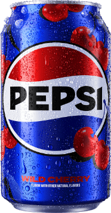
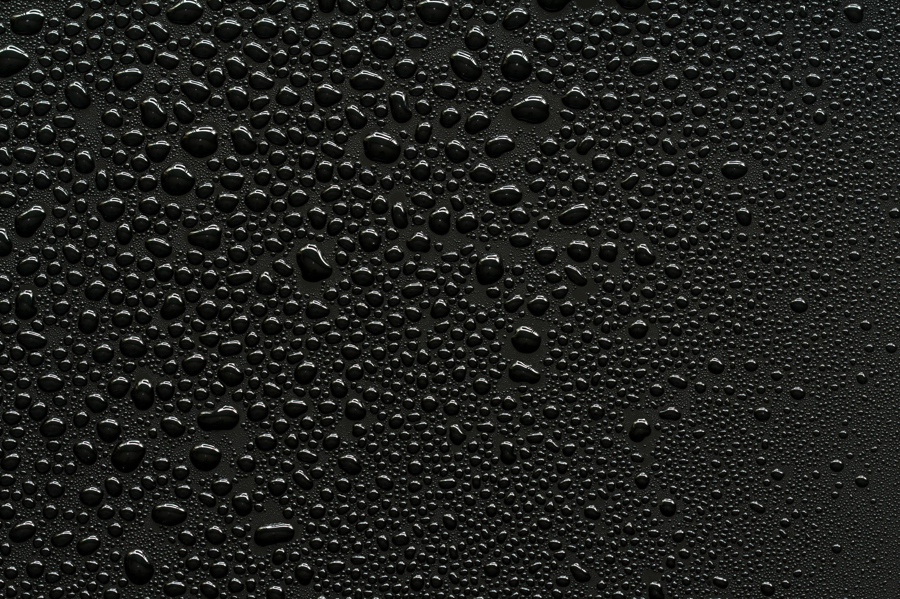

# PEPSI Template

## Ressources

Most of the resources (logo, favicon, font, etc.) come from the [pepsi.com](https://pepsi.com/) website.

### Fonts

- [PepsiOwners-Regular](./assets/fonts/PepsiOwners-Regular.woff2)

### Images

<table>
    <tr><th><a href="https://pepsi.com">Logo</a></th></tr>
    <tr><td></td></tr>
</table>
<table>
    <tr><th colspan=4><a href="https://pepsi.com">Can</a></th></tr>
    <tr>
        <th>Original</th>
        <th>Zero Sugar</th>
        <th>Diet</th>
        <th>Wild Cherry</th>
    </tr>
    <tr>
        <td></td>
        <td></td>
        <td></td>
        <td></td>
    </tr>
</table>
<table>
    <tr><th>Background</th></tr>
    <tr><th><a href="https://fr.vecteezy.com/photo/6899260-gouttelettes-d-eau-sur-fond-noir">Water Droplets on a Black Background</a></th></tr>
    <tr><td></td></tr>
</table>
